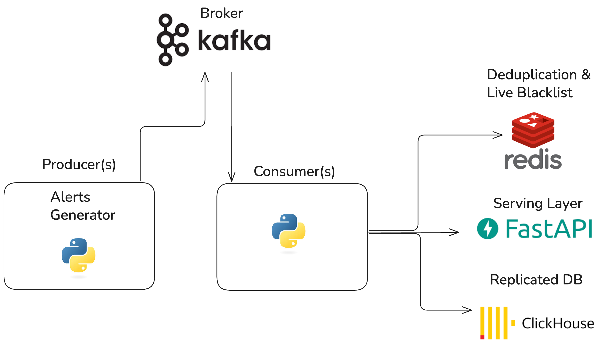
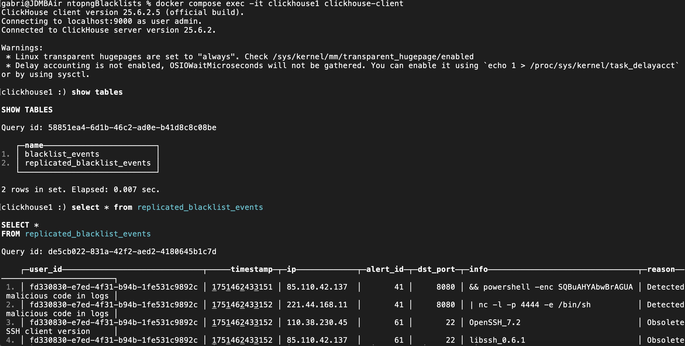

# ntopngBlacklists

This project implements a distributed application designed to ingest live network alerts generated by an [ntopng](https://github.com/ntop/ntopng) instance and dynamically create blacklists in realtime. 

# Architecture
Below it is shown a diagram of the architecture.


- **Kafka** serves as the messaging layer between producers and consumers.
- **Multiple** producers generate synthetic alert data and publish it to a **Kafka topic** (blacklist-events). Kafka is deployed with 3 replicas, coordinated by zookeper.
- **Consumers** subscribe to the topic and consume each message:
    - Updating **Redis** keys: `blacklist:{alert_id}:ip_counters` to keep track of how many times an IP was reported for a given alert_id. 
    - **Deduplication** before increasing counters in redis, deduplication is performed as kafka provides an at least once semanthic, so alerts could be received more than once.
    The following key with a TTL specified in the config is created to handle deduplication: `dedup:{user_id}:{timestamp}:{alert_id}:{ip}:{info}:{reason}` these fields are the set of values used to uniquely identify an alert generated by a specific user (user_id)
    - **Events persistence** consumers also save data to a clickhouse cluster made of two replicas for this purpose. Each event is saved in the table [blacklist_events](clickhouse/create_tables.sql) for later retrieval and analytics similar to [AbuseIPDB](https://www.abuseipdb.com/) for historical query.
- **Redis cluster** a redis cluster was deployed using docker compose, this cluster is made up of 6 redis instances, the configuration is specified in [redis.conf](redis/redis.conf).
- **Clickhouse cluster** a clickhouse cluster made of two clickhouse instances is created in the docker compose, each instance is a replica of the same shard as specified in the two configuration files [Clickhouse1](clickhouse/clickhouse1/config/macros.xml) and [Clickhouse2](clickhouse/clickhouse2/config/macros.xml), so that fault tolerance and data availability are guaranteed. For docs on [Clickhouse replication](https://clickhouse.com/docs/architecture/replication)

Finally a fastapi server exposes two endpoints on port 8000 to let users query live data. A [Postman Collection](Postman/Blacklists.postman_collection.json) is present in this repository to document the endpoints. To quickly go over the endpoints:
- **GET /ip_events/{ip}** -> let's users query the historical events for a given IP, in this case the last 10 events are returned in the format: ```json
  {
    "ip": "1.2.3.4",
    "events": [
      {
        "timestamp": "<ts>",
        "alert_id": "<id>",
        "info": "<description>",
        "reason": "<detection reason>"
      }
    ]
  }```
- **GET /blacklists/{alert_id}&format={json|txt}** -> returns the current blacklist given an alert_id. [Below](#alert-ids) is a list of alert IDs utilized in this project.

# Synthetic Alerts

For the purpose of this project, synthetic alerts are generated using [alerts_generator.py](src/utils/alerts_generator.py). These alerts are created with random values based on real world examples previously collected and parsed using [alerts_parser.py](src/utils/alerts_parser.py)

# Code organization

- `src/config/` contains:
    1. [kafka topic creation script](src/config/create_topic.sh)
    2. [Configuration.yaml ](src/config/config.yaml)
    3. [Configuration Manager](src/config/config_manager.py) utility class to parse the config and expose getters for producer, consumer, redis and clickhouse config.
- `src/consumer/` and `src/producer/` contain code for producers and consumers, configuration is read as specified in the point above.
- `src/api_server` contains a fast api server to let users make queries to the live blacklist
- `src/utils/` contains utility classes shared by producers, consumers and api server: such as db connector, alerts generator and redis connector

## Alert IDs

These alerts ID are extracted from each alert (`alert.flow_risk_info[ALERT_ID]`) in producer/alerts_parser.py:

- **Possible SQL Injection:** ID 40
- **Possible RCE Injection:** ID 41
- **Empty or missing user agent:** ID 42
- **Possible Exploit:** ID 68
- **SSH obsolete version**: ID 61
- **Malicious Fingerprint:** ID 79

## Startup
For simplicity, all the services have been created in a single docker compose file, in a distributed system we would have to deploy services on different machines based on the tradeoffs decided at requirements time and change the IPs/ports with hostnames to hide distribution changes and do not modify producers config to which we do not have access in a real world case.

To launch the project simply run: <pre lang="markdown"> ```bash docker compose up --build ```</pre> to build the containers and see the live output.

To change the number of generated alerts, please modify [Configuration.yaml ](src/config/config.yaml)

### Clickhouse data

To check that data is inserted in clickhouse: 
<pre lang="markdown"> ```bash docker compose exec -it clickhouse1 clickhouse-client ```</pre> 
and 
`select * from replicated_blacklist_events`

And an output similar to the following should be present:

### Running multiple consumers and producers
To run more than 1 consumer or producer, after successful build run: <pre lang="markdown"> ```bash docker compose up --build --scale consumer=4 --scale producer=4```</pre>
` Be sure to use a maximum number of consumers equal to the number of partitions specified in [create_topics.sh ](src/config/create_topic.sh)
